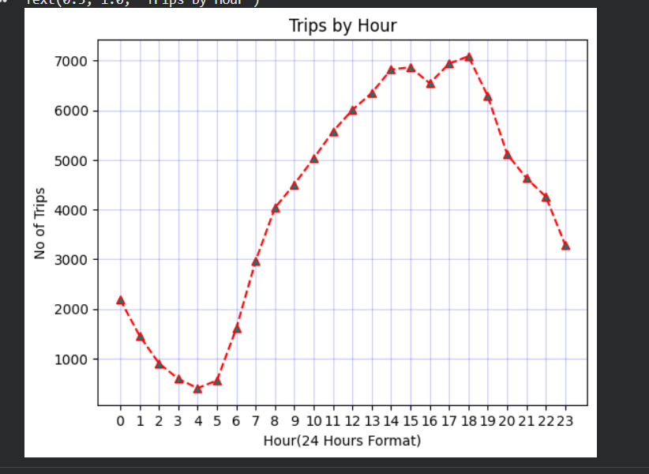
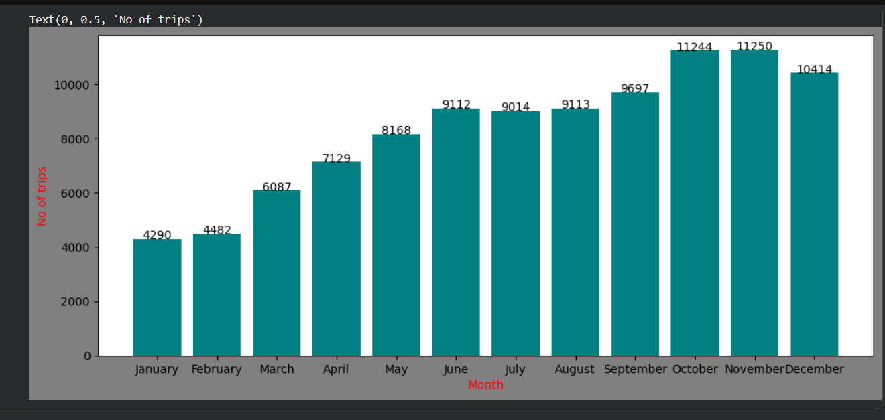
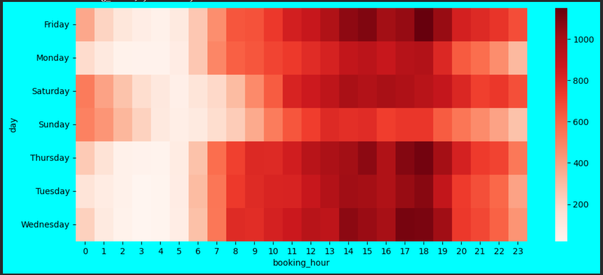
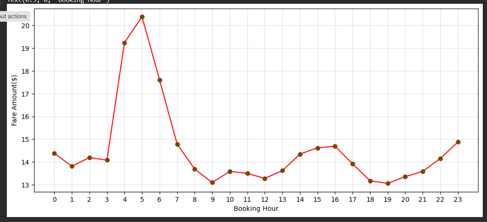
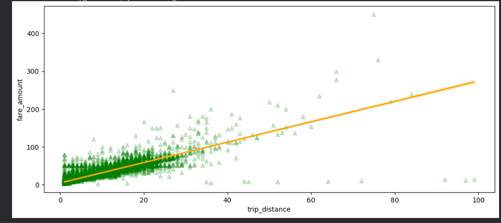
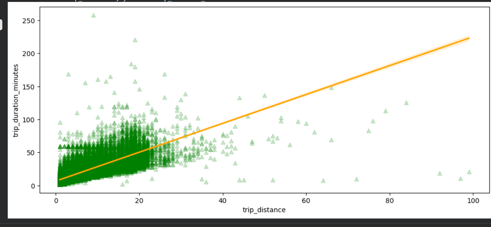
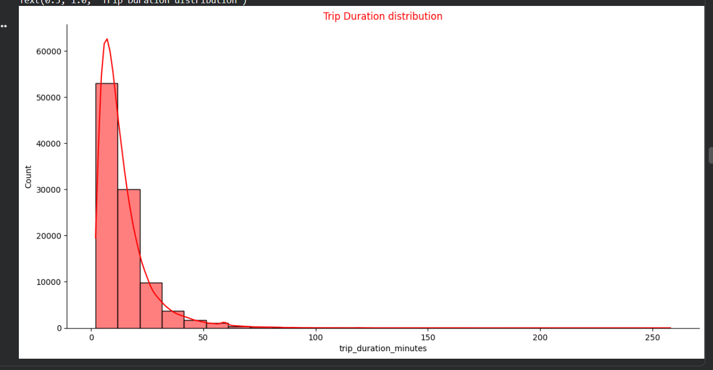
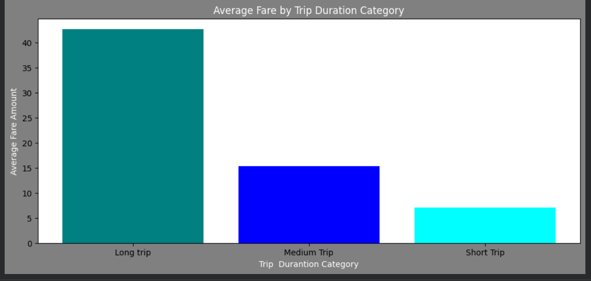
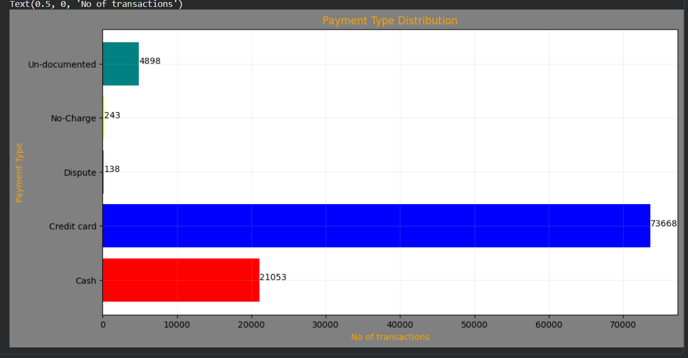
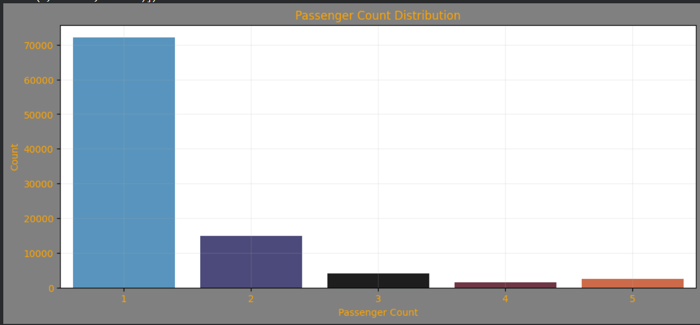

<div align="center">

# 🚕 NYC Yellow Taxi 2021 — End-to-End Data Analysis

### **28.1M Cleaned Trips · 30 Business Questions · BigQuery + SQL + Python**

[](https://cloud.google.com/bigquery)
[](https://python.org)
[](https://pandas.pydata.org)
[](https://seaborn.pydata.org)
[](https://matplotlib.org)
[](https://colab.research.google.com)

---

### 🚖 From 30.9M Raw Records → 28.1M Cleaned Trips → 30 Business Questions → Actionable Insights

</div>

---

## 📌 Project Overview

This project presents an **end-to-end exploratory data analysis (EDA)** of the **NYC Yellow Taxi 2021 dataset**, containing more than **30.9 million raw trip records**.

The project focuses heavily on **data quality, cleaning, validation, SQL-based analysis, statistical exploration, and visualization** rather than simply producing charts.

The analysis was performed using **Google BigQuery for large-scale data processing and SQL analysis**, followed by **Python, Pandas, Matplotlib, and Seaborn** for sample-based exploratory analysis and visualization.

### 🔄 Analytical Workflow

```text
NYC Yellow Taxi Public Dataset
              ↓
     Initial Data Exploration
              ↓
     Extensive Data Cleaning
        & Feature Engineering
              ↓
      Cleaned BigQuery Table
          28.1M Trips
              ↓
     30 Business Questions
          Using SQL
              ↓
      Random 100K Sample
              ↓
     Python / Pandas Analysis
              ↓
   Matplotlib + Seaborn Visuals
              ↓
       Cross-Validation
              ↓
      Business Insights
```

---

## 🎯 Project Objectives

The analysis was designed to answer practical business questions around:

* 🚕 Trip demand and travel patterns
* ⏰ Peak operating hours
* 📅 Monthly demand and revenue
* 💰 Fare and revenue behavior
* 📏 Distance and trip duration
* 💳 Payment preferences
* 👥 Passenger behavior
* 📍 Pickup and drop-off locations
* 🛣️ Popular routes
* 📈 Relationships between operational variables
* 🚨 Data quality and extreme-value detection

---

# 🧹 Data Cleaning & Quality Control

One of the major components of this project was **extensive data cleaning**.

The raw dataset contained significant data-quality issues, including unrealistic years, zero/negative durations, suspicious distances, invalid monetary values, unusual passenger counts, and extreme monetary outliers.

The final cleaning process retained:

| Metric                                    |      Value |
| ----------------------------------------- | ---------: |
| **Original records**                      | 30,904,427 |
| **Cleaned records**                       | 28,101,643 |
| **Records removed**                       |  2,802,784 |
| **Retention rate**                        | **90.93%** |
| **Records used for Python visualization** |    100,000 |

### Cleaning Rules

| Field           | Condition               | Reason                                                             |
| --------------- | ----------------------- | ------------------------------------------------------------------ |
| Year            | `= 2021`                | Remove irrelevant and corrupted years                              |
| Trip duration   | `> 1 and < 300 minutes` | Remove extremely short/cancelled trips and anomalous long journeys |
| Trip distance   | `> 0 and < 100 miles`   | Remove zero/negative and highly suspicious distances               |
| Fare amount     | `> 0 and <= 600`        | Remove invalid and extreme fare values                             |
| Total amount    | `> 0 and < 900`         | Remove invalid and extreme transaction values                      |
| Extra charges   | `>= 0`                  | Prevent invalid negative charges                                   |
| Passenger count | `1–5 or NULL`           | Remove invalid counts while preserving missing information         |

📋 A detailed explanation of the cleaning decisions and their rationale is available in:

**`nyc_taxi_trips/Data_Cleaning_Methodology.md`**

---

# 🔎 A Major Data Quality Discovery

One of the most interesting findings emerged while comparing SQL and Python results.

Initially:

* **BigQuery SQL correlation:** `0.064`
* **Pandas sample correlation:** `~0.93`

This large discrepancy triggered a deeper investigation.

The analysis identified **six extreme fare records above $600**, including exceptionally large values such as a fare of approximately **$818K**.

These extreme observations had a disproportionate effect on the full-dataset correlation.

After applying the extreme-value threshold:

**Trip Distance ↔ Fare Amount**

`0.064 → 0.935`

This demonstrated how **extreme observations can dramatically distort statistical relationships**, especially when working with millions of records.

It also became an important example of why **cross-validating results between SQL and Python is valuable in real-world data analysis.**

---

# 📊 Analysis Performed

## 1️⃣ Overall Trip Analysis

* **28.1M** cleaned trips
* Total recorded revenue: **~$563.9M**
* Average fare: **$13.97**
* Median fare: **$10**
* Average trip distance: **3.38 miles**
* Median trip distance: **2 miles**
* Average trip duration: **14.19 minutes**
* Median trip duration: **11 minutes**

The difference between the mean and median fare demonstrates the **right-skewed nature of taxi fares**.

---

## 2️⃣ Time & Demand Analysis

### Key Findings

* **November** recorded the highest trip volume.
* **January** recorded the lowest trip volume.
* November also generated the highest monthly revenue at approximately **$67.1M**.
* **December** recorded the highest average fare at approximately **$14.79**.
* **18:00** was the busiest hour.
* **04:00** was the quietest hour.

### Demand ≠ Fare

An important finding was that **the busiest hours were not necessarily the most valuable hours**.

The highest average fare occurred around **5 AM (~$21)**, largely influenced by longer trips such as airport journeys.

This shows the difference between:

**High demand ≠ High revenue per trip**

---

## 3️⃣ Fare & Revenue Analysis

* Revenue per mile: approximately **$5.93**
* Tips represented approximately **12.05% of recorded revenue**
* The **51–60 mile** category generated the highest average fare per trip at approximately **$155**
* Tip amount generally increased as fare increased.
* However, **tip percentage declined at higher fare levels**.
* Cash trips contain almost no recorded tips.

### Important Data Limitation

The lack of recorded cash tips does **not** necessarily mean cash passengers tip less.

It reflects a limitation of the dataset: cash tips are not captured in the same way as electronic payment tips.

---

# 4️⃣ Trip Characteristics

Trip distances were divided into three categories:

| Category  |     Distance |     Share |
| --------- | -----------: | --------: |
| 🚶 Short  |  `< 2 miles` | **36.3%** |
| 🚕 Medium | `2–10 miles` | **57.2%** |
| 🛣️ Long  | `> 10 miles` |  **6.4%** |

The majority of taxi journeys were therefore **short-to-medium distance trips**.

### Correlation Analysis

**Trip Distance ↔ Fare**

**r = 0.935** after extreme-value treatment.

**Trip Distance ↔ Duration**

**r ≈ 0.77–0.78**

The strong distance-duration relationship is intuitive: longer journeys generally require more travel time.

---

# 5️⃣ Payment & Passenger Analysis

### Payment

Credit cards were the dominant payment method:

* Credit card: **~20.75M**
* Cash: **~5.88M**

Average recorded trip amount:

* Credit card: **~$20.21**
* Cash: **~$16.83**

### Passenger Count

Solo passengers dominate the dataset.

In the 100K Python sample, approximately **72% of trips involved one passenger**.

There was no strong linear relationship between passenger count and average fare.

---

# 6️⃣ Location & Route Analysis

### Pickup Demand

**Upper East Side South** recorded the highest pickup demand, with approximately **1.4M trips**.

### Revenue

**JFK Airport** generated exceptionally high total revenue despite having fewer trips than the busiest Manhattan zones.

This is explained by the longer average distance and higher value of airport journeys.

### Popular Route

The most frequently travelled route was:

**Upper East Side South ↔ Upper East Side North**

### Key Business Finding

> **The busiest routes are not necessarily the most profitable routes.**

High-volume Manhattan routes can generate large amounts of total revenue through sheer trip count, while airport routes can generate substantially more revenue **per individual trip**.

---

# 🔑 Key Business Insights

### 💡 1. November drives volume, while December drives value

November recorded the highest trip volume, while December recorded the highest average fare.

---

### 💡 2. Early-morning trips are disproportionately valuable

The highest average fare occurred around **5 AM**, largely because of longer airport-oriented journeys.

---

### 💡 3. JFK generates high-value trips

Airport trips demonstrate that **trip value matters alongside trip volume**.

---

### 💡 4. Credit cards dominate recorded payments

Electronic payments significantly outnumbered cash payments in the dataset.

---

### 💡 5. Recorded cash tips cannot be interpreted as actual tipping behavior

The dataset does not adequately capture cash tips, making direct comparison of tipping behavior between payment methods unreliable.

---

### 💡 6. Outlier treatment changed the correlation story

The distance-fare relationship initially appeared weak in the full SQL analysis.

After investigating extreme observations, the correlation increased from:

**0.064 → 0.935**

This demonstrates the importance of **data validation, outlier investigation, and cross-tool verification**.

---

# 🛠️ Tools & Technologies

| Technology          | Usage                                                        |
| ------------------- | ------------------------------------------------------------ |
| **Google BigQuery** | Large-scale data storage, cleaning and SQL analysis          |
| **SQL**             | Data cleaning, feature engineering and 30 business questions |
| **Google Colab**    | Python analysis environment                                  |
| **Python**          | Exploratory analysis                                         |
| **Pandas**          | Data manipulation and statistical analysis                   |
| **Matplotlib**      | Visualization                                                |
| **Seaborn**         | Statistical visualization                                    |

---

# 📂 Repository Structure

The project is organized into separate sections for reproducibility and easier navigation.

```text
Nyc-Taxi-Trips--Bigquery-Pandas-Maplotlib-analysis/
│
├── README.md
│
└── nyc_taxi_trips/
    │
    ├── Jupyter_notebooks/
    │   ├── Initial_exploration_and_cleaning_.ipynb
    │   └── Nyc_Taxi_sample_visualisation_analysis.ipynb
    │
    ├── SQL Files/
    │   ├── Cleaned_nyc_taxi_table_generator (2).sql
    │   └── EDA_nyc_taxi_query (2).sql
    │
    ├── Visual_graph_screenshots/
    │   ├── Screenshot 2026-09-08 002723.png
    │   ├── Screenshot 2026-09-08 002737.png
    │   ├── ...
    │   └── Screenshot 2026-09-08 002922.png
    │
    ├── Data_Cleaning_Methodology.md
    └── Nyc_taxi_dataset_sample(100_000 rows)
```

The repository structure has been separated into **SQL, notebooks, visualizations, and methodology**, making the project easier to navigate and reproduce.

---

# ▶️ How to Reproduce

This project can be reproduced using **Google BigQuery + Python/Google Colab**.

> **Important:** You must use your own Google Cloud project and replace the project ID in the SQL files. Do not use the author's project ID.

---

## 🗄️ Part 1 — BigQuery Setup

### Step 1 — Create a Google Cloud Project

If you do not already have a Google Cloud project:

1. Open Google Cloud Console.
2. Create a new project.
3. Give the project any name you prefer.
4. Note your **Project ID** — you will need it in the SQL scripts and Python notebooks.

You will use this project to create and store your own cleaned NYC Taxi table and lookup table.

---

### Step 2 — Open BigQuery

Open BigQuery Studio from your Google Cloud project.

The original NYC Yellow Taxi dataset is publicly available through BigQuery:

```text
bigquery-public-data.biglake-public-nyc-taxi-iceberg.public_data.nyc_taxicab_2021
```

You do **not** need to copy the public dataset into your project.

---

## 🧹 Part 2 — Create the Cleaned Table

Before running the EDA queries, you must first create the cleaned table.

Open:

```text
nyc_taxi_trips/
└── SQL Files/
    └── Cleaned_nyc_taxi_table_generator (2).sql
```

### Step 3 — Update the Project ID

At the beginning of the SQL file, the cleaned table is created using a project ID.

Replace the author's project ID with **your own Google Cloud Project ID**.

For example:

```text
CREATE OR REPLACE TABLE `YOUR_PROJECT_ID.Nyc_taxi_trips.cleaned_taxi_data`
```

Replace:

```text
YOUR_PROJECT_ID
```

with your own Project ID.

> **Do not change the public dataset reference:**
>
> `bigquery-public-data.biglake-public-nyc-taxi-iceberg.public_data.nyc_taxicab_2021`
>
> Only the destination project/table should use your own project.

---

### Step 4 — Enable the SQL

The cleaning SQL file contains explanatory comments describing the cleaning decisions.

The executable SQL statements must be uncommented before running the query.

After replacing the project ID and removing the `#` comment markers from the executable SQL, run the complete cleaning query in BigQuery.

The script will:

* Create the required derived columns
* Filter the data to 2021
* Remove invalid trip durations
* Remove suspicious trip distances
* Remove invalid fare and total amounts
* Handle invalid passenger counts
* Apply the project's defined outlier and data-quality filters
* Create the final cleaned table

The resulting table will be:

```text
YOUR_PROJECT_ID.Nyc_taxi_trips.cleaned_taxi_data
```

> **Note:** Query results may vary if the underlying public dataset is updated.

---

## 📍 Part 3 — Import the Taxi Zone Lookup Table

The project also uses a **Taxi Zone Lookup Table** to translate the numeric pickup and drop-off location IDs in the taxi dataset into meaningful NYC taxi zone names and geographic information.

The lookup file is included in the repository:

```text
nyc_taxi_trips/
└── taxi_zone_lookup.csv
```

### Step 5 — Upload the Lookup Table to BigQuery

After creating the cleaned taxi table, upload:

```text
taxi_zone_lookup.csv
```

to your own BigQuery project.

Create a dataset if you do not already have one:

```text
YOUR_PROJECT_ID.Nyc_taxi_trips
```

Then create/import the lookup table as:

```text
YOUR_PROJECT_ID.Nyc_taxi_trips.taxi_zone_lookup
```

When importing the CSV, make sure BigQuery detects the column names from the first row of the file.

The lookup table is used to map:

* `PULocationID` → Pickup Zone
* `DOLocationID` → Drop-off Zone

This allows the numeric location IDs in the taxi dataset to be converted into readable geographic information.

> **Important:** The lookup table is a supporting reference table and does **not** replace the original NYC Taxi dataset.

---

## 📊 Part 4 — Run the 30 Business Questions

Once the cleaned table has been successfully created, open:

```text
nyc_taxi_trips/
└── SQL Files/
    └── EDA_nyc_taxi_query (2).sql
```

Before running the queries, replace any reference to the author's cleaned table with your own:

```text
YOUR_PROJECT_ID.Nyc_taxi_trips.cleaned_taxi_data
```

The SQL file contains **30 business questions** covering:

* Overall trip performance
* Time and demand
* Fare and revenue
* Trip characteristics
* Payment and passenger analysis
* Pickup/drop-off locations and routes

Each query is designed to be run independently.

---

# 🐍 Part 5 — Python / Google Colab Analysis

The Python portion of the project uses a **100,000-row random sample** of the cleaned data rather than loading the entire dataset into Pandas.

The notebooks are located in:

```text
nyc_taxi_trips/
└── Jupyter_notebooks/
```

### Step 1 — Open the Notebook

Open either:

* `Initial_exploration_and_cleaning_.ipynb`
* `Nyc_Taxi_sample_visualisation_analysis.ipynb`

These notebooks can be opened using **Google Colab** or Jupyter Notebook.

---

### Step 2 — Connect to BigQuery

If reproducing the Python analysis from BigQuery:

1. Authenticate with your Google account.
2. Connect the notebook to your Google Cloud project.
3. Update the `project_id` variable to **your own Project ID**.
4. Make sure the notebook references your cleaned table:

```text
YOUR_PROJECT_ID.Nyc_taxi_trips.cleaned_taxi_data
```

---

### Step 3 — Import the Taxi Zone Lookup Table in Pandas

For the geospatial analysis, the `taxi_zone_lookup.csv` file must also be loaded into the Python environment.

The lookup table will be used together with the taxi trip data to translate:

```text
PULocationID
DOLocationID
```

into:

```text
Pickup Zone
Drop-off Zone
```

The location IDs from the taxi trip data can then be matched with the corresponding records in the lookup table.

This lookup will be used for the **geospatial analysis and visualizations** created later in the project.

---

### Step 4 — Install Required Libraries

The Python environment requires:

```text
google-cloud-bigquery
pandas
db-dtypes
matplotlib
seaborn
```

Additional geospatial libraries may be required for the geospatial visualizations, depending on the visualization method used.

---

## 📂 Repository Structure

The important project files are organized approximately as follows:

```text
nyc_taxi_trips/
│
├── SQL Files/
│   ├── Cleaned_nyc_taxi_table_generator (2).sql
│   └── EDA_nyc_taxi_query (2).sql
│
├── Jupyter_notebooks/
│   ├── Initial_exploration_and_cleaning_.ipynb
│   └── Nyc_Taxi_sample_visualisation_analysis.ipynb
│
├── Visual_graph_screenshots/
│   └── [visualization screenshots]
│
└── taxi_zone_lookup.csv
```

---

## 🔄 Complete Reproduction Flow

For the full project, follow this order:

```text
1. Create your Google Cloud Project
              ↓
2. Open BigQuery
              ↓
3. Access the public NYC Taxi dataset
              ↓
4. Open the Cleaning SQL file
              ↓
5. Replace the author's Project ID
   with YOUR Project ID
              ↓
6. Uncomment the executable SQL
              ↓
7. Run the Cleaning SQL
              ↓
8. Your cleaned_taxi_data table is created
              ↓
9. Upload taxi_zone_lookup.csv
   to your BigQuery project
              ↓
10. Create taxi_zone_lookup table
              ↓
11. Open the EDA SQL file
              ↓
12. Replace table references with YOUR
    cleaned table
              ↓
13. Run the 30 business questions
              ↓
14. Open the Python / Google Colab notebooks
              ↓
15. Load the 100K sample
              ↓
16. Load taxi_zone_lookup.csv
              ↓
17. Match Pickup/Drop-off Location IDs
    with the lookup table
              ↓
18. Perform Python visual analysis
              ↓
19. Perform geospatial analysis
              ↓
20. Explore the final visualizations
    and insights
```

---

## 📦 Alternative: Offline Python Analysis

A **100,000-row sample CSV** is included in the repository.

This allows the Python visualizations and sample analysis to be explored without querying BigQuery.

The CSV contains the sample used for the Python analysis, while the BigQuery SQL files contain the full-scale analysis logic.

The `taxi_zone_lookup.csv` file is also included so that the location IDs in the sample can be mapped to their corresponding taxi zones.

---

> ### ⚠️ Important
>
> The author's Google Cloud project is **not required** to reproduce this project.
>
> You should create your **own Google Cloud project**, create your own `Nyc_taxi_trips` dataset if necessary, generate your own `cleaned_taxi_data` table using the provided cleaning SQL, and upload the provided `taxi_zone_lookup.csv` as your own lookup table.
>
> The public NYC Taxi dataset remains the source dataset. The cleaned table and lookup table are created/imported into **your own project**.


## Python Analysis

The Python analysis uses a **100,000-row random sample** from the cleaned dataset.

The notebooks are located in:

`nyc_taxi_trips/Jupyter_notebooks/`

The notebooks perform:

* Exploratory analysis
* Distribution analysis
* Correlation analysis
* Trip categorization
* Payment analysis
* Passenger analysis
* Visualization
* Statistical validation

---
# 📊 Visualizations & Key Insights

The following visualizations were created using a **random sample of 100,000 rows** from the cleaned NYC Yellow Taxi 2021 dataset.

### 🕐 Trips by Hour



> **Insight:** Demand is lowest during the early-morning hours, rises throughout the day, and reaches a clear peak around **18:00**, before gradually declining into the evening.

---

### 📅 Trips by Month



> **Insight:** **January and February** have the lowest demand. Trips increase steadily through the middle of the year, while **October to December** show the strongest demand, with **November among the highest-demand months**.

---

### 🌡️ Trips by Hour & Day of Week



> **Insight:** **Saturday and Sunday** show noticeable demand around **midnight**, possibly reflecting weekend late-night activity. Weekend demand is also lower around **6–7 AM** compared with weekdays before rising toward the evening peak.

---

### 💰 Average Fare by Hour



> **Insight:** Average fares peak in the early morning, reaching **over $21 around 5 AM**, then remain lower during regular business hours. The early spike may reflect a higher share of longer-distance trips.

---

### 📏 Trip Distance vs Fare



> **Insight:** Trip distance and fare show a **strong positive relationship (r ≈ 0.935)** after excluding six extreme fare outliers above $600.

---

### ⏱️ Trip Distance vs Duration



> **Insight:** A **strong positive correlation (r ≈ 0.77)** shows that longer trips generally require more travel time.

---

### 📊 Trip Duration Distribution



> **Insight:** Trip durations are concentrated in the shorter ranges, with frequencies generally declining as duration increases and a long tail representing fewer longer trips.

---

### 🚕 Average Fare by Trip Duration



> **Insight:** Average fare increases substantially with trip duration, with **long trips generating the highest average fares** and short trips the lowest.

---

### 💳 Payment Type Distribution



> **Insight:** **Credit card payments dominate** the sample, followed by cash. The sample also contains a noticeable number of **undocumented payment types**.

---

### 👥 Passenger Count Distribution



> **Insight:** **Single-passenger trips dominate** the sample, with over **70,000** observations. Two-passenger trips are considerably lower, while trips with three or more passengers make up only a small share.

---

> **Note:** The visualizations are based on a random **100,000-row sample** from the cleaned dataset and are intended to illustrate the major patterns identified during the exploratory data analysis.


`nyc_taxi_trips/Visual_graph_screenshots/`

---

# ⚠️ Limitations

This analysis has several important limitations:

* Revenue is based on the `total_amount` recorded in the dataset and has not been independently verified against payment processor records.
* Cash tips are not captured reliably, so tip analysis primarily represents recorded electronic-payment tips.
* Python visualizations use a **100,000-row random sample**, not the entire 28.1M cleaned dataset.
* Some 2021 demand patterns may have been influenced by the continuing effects of the COVID-19 pandemic.
* Outlier thresholds were established specifically for analytical purposes and should not automatically be interpreted as proof that every excluded transaction was invalid.
* The analysis focuses on the variables available in the public dataset and therefore cannot explain factors such as weather, traffic conditions, driver availability, or passenger demographics.

---

# 📋 Project Documentation

### 🧹 Data Cleaning Methodology

Detailed explanation of the cleaning decisions, assumptions, anomalies and thresholds:

`nyc_taxi_trips/Data_Cleaning_Methodology.md`

### 🗄️ SQL Analysis

Contains the BigQuery cleaning pipeline and **30 business questions**:

`nyc_taxi_trips/SQL Files/`

### 📓 Python Analysis

Contains the exploratory and visualization notebooks:

`nyc_taxi_trips/Jupyter_notebooks/`

### 📊 Visualizations

All generated visualization screenshots:

`nyc_taxi_trips/Visual_graph_screenshots/`

---

# 🚀 What This Project Demonstrates

This project demonstrates practical experience with:

**Large-scale SQL analysis**

→ Working with tens of millions of records in BigQuery.

**Data cleaning**

→ Identifying and handling invalid, suspicious and extreme observations.

**Feature engineering**

→ Creating trip duration, year, day and month analytical features.

**Exploratory Data Analysis**

→ Investigating distributions, relationships and behavioral patterns.

**Statistical reasoning**

→ Using correlation, distributions, averages and medians to understand the data.

**Cross-tool validation**

→ Comparing BigQuery results against Python/Pandas analysis.

**Business analysis**

→ Translating millions of raw records into understandable business findings.

**Data storytelling**

→ Turning analytical results into clear visual and business insights.

---

<div align="center">

# 👤 Author

## **Rahul Datta Roy**

**Data Analyst | SQL | Python | Power BI | BigQuery**

[](https://linkedin.com/in/rahul-datta-roy-0340a7209)

[](https://github.com/rahuldattaroy2727-cmd)

---

### ⭐ If you found this project useful, consider giving it a star!

</div>
